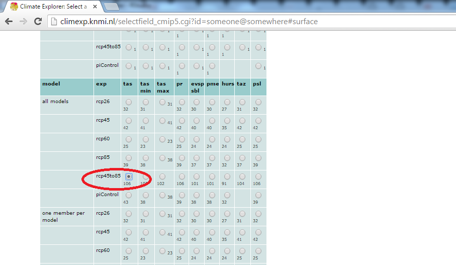
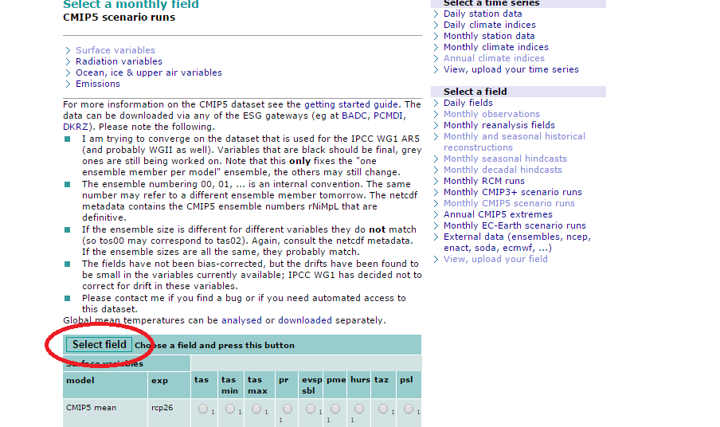
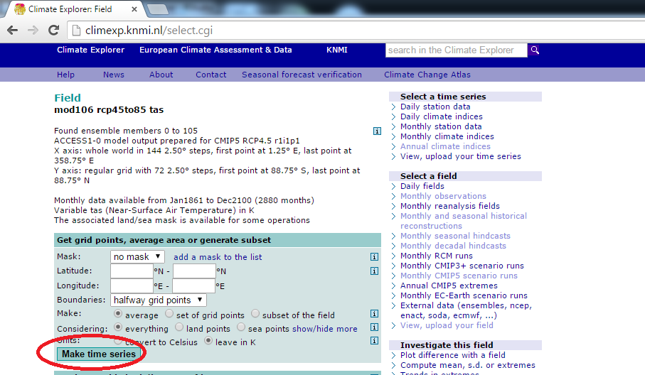
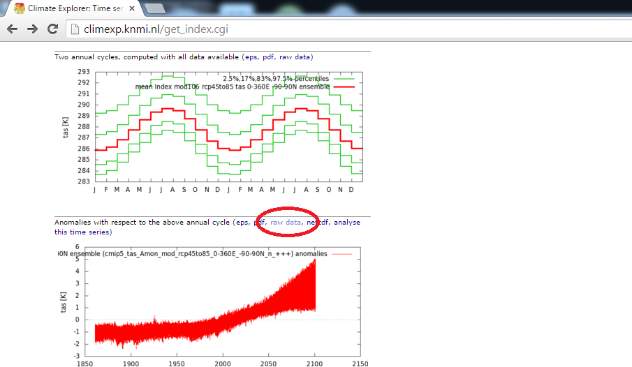

To download the full CMIP5 ensemble data, first go to the [Climate Explorer website](http://climexp.knmi.nl/selectfield_cmip5.cgi?id=someone@somewhere#surface) to get the model scenario runs. 

Scroll down to "all models" => "rcp45to85" and choose the first option under the "tas" column (i.e. 106). Note: This actually gives us 108 models, so I'm not entirely sure why it says 106... 

<div align="center">

</div>

Scroll back up to click *Select Field*. 

<div align="center">

</div>

On the next page, click *Make time series*. Wait for the data to load. This may take a few minutes. 

<div align="center">

</div>

Once that's ready, you'll see links to download the raw data in .txt format and you're good to go.

<div align="center">

</div>

A final comment is that this data comes at a monthly resolution from 1860 to 2100 (for all 108 models!) and is consequently much more detailed than we need for the current exercise. Here is a short script to clean the data (i.e. ignore future years, get into annual time steps, and group by model):

```{r, eval = F}
require(readr) ## For reading in data
require(tidyr) ## For data tidying (gather, etc.)
require(dplyr) ## For data munging and manipulation (filter, mutate, etc.)

## Read the data (replace "cmip5_full.txt" with whatever you have called the file)
cmip5_full <- read_table("cmip5_full.txt", skip = 7, col_names = c("Date", "Temp"))

## Clean and summarise the data
cmip5 <- 
  cmip5_full %>% 
  filter(!is.na(Date)) %>%
  mutate(Year = Date %/% 1,  ## Create Year variable using integer division operator
         Month = round((Date %% 1) * 12 + 1)   ## Create Month variable using modular operator
         ) %>%
  filter(Year <= 2014) %>%   ## M&k only compare models and temp up to 2014
  mutate(Model = rep(001:108, each = 12 * (2014 - 1860))) %>%  ## Assign model id for all 108 models
  group_by(Model, Year) %>% ## Group by climate model id (and year for annual means)
  summarise(Temp = mean(Temp)) ## Collapse into annual means

## Save this new dataset
write_csv(cmip5, "cmip5.csv")

```